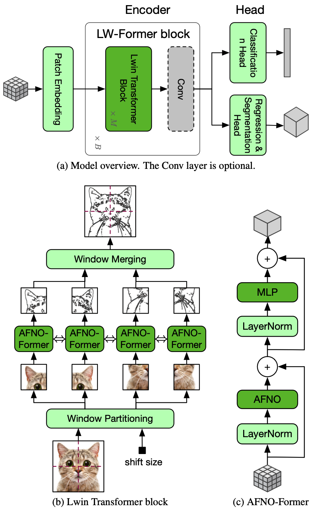
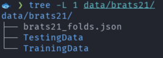

## Model Overview
This repository contains the code for LW-Former. 
The architecture of LW-Former is demonstrated as below: 


## Environment & Dependencies
1. [Ananconda](https://docs.anaconda.com/free/anaconda/install/index.html)/[Miniconda](https://docs.conda.io/projects/miniconda/en/latest/miniconda-install.html) installation.
2. Virtual environment creation & dependency installation
```bash
bash create_env.sh
```

## Data
### BRaTS 2021 Task 1 Dataset
Download the BraTS21 dataset from [Kaggle](https://www.kaggle.com/datasets/dschettler8845/brats-2021-task1/data). 
and extract it into the './data/brats21' folder. 
Make sure the content of this folder looks like this: 



### Cosmological Simulation dataset
Preparing...

### ImageNet-1K
Download the Imagenet-1K dataset from [image-net.org](https://www.image-net.org/download.php) and 
place it into the './data/imagenet/' folder. 

## Training
The training script is `./gkai/train.py`, 
which support all three tasks introduced in the paper. 
The training script requires a configuration file to run. 
The configuration file mainly contains information about:

- what model used, 
- which dataset used, 
- optimizer, lr_scheduler,
- the evaluation metrics, inference method, 
- other hyper-parameters, such learning rate, batch size, etc. 

You can see some examples in the `./gkai/cfg` directory. 

The training script support 1-node multi-gpu distributed training, which is based on pytorch's torchrun. 
It may also support multi-node multi-gpu distributed training, but not test yet.

```bash
# You can the wandb to `False` if you do not want to use wandb.ai to record the training process. 
wandb=True
# You should run `wandb login` first or specify the `WANDB_API_KEY` environment variable. 
# export WANDB_API_KEY=<api_key>

cd /path/to/project/root
source set_env.sh
export CUDA_VISIBLE_DEVICES='0,1,2,3,4,5,6,7'
gpus=8

torchrun --rdzv-backend=c10d --rdzv-endpoint=localhost:0 --nnodes=1 --nproc-per-node=$gpus \
    ./gkai/train.py \
    -c "./gkai/cfg/brats21-swin-afno-005.yaml" \
    -x wandb.enabled=$wandb
```

If you do not want to use distributed training, just run the `train.py` script. 
For example, 

```bash
python ./gkai/train.py -c "./gkai/cfg/brats21-swin-afno-005.yaml" -x wandb.enabled=True
```

## Evaluation

```bash
python ./gkai/evaluate.py -c "./gkai/cfg/brats21-swin-afno-005.yaml" \
    -x model.pretrained_path=2023-10-12-09.51.55-PqtjgWaoryPjH8Zw/best-model-0093-468000.pt
```
Note you should replace the `model.pretrained_path` with your own value. 
The value can be found in the `./cache/brats21-swin-afno-model` directory
(a path depends on the value of configuration item `model.model_save_subdir`) 
with the random run id (`run.id`) logged to the terminal. 
